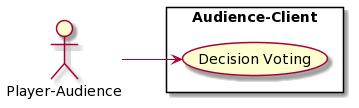
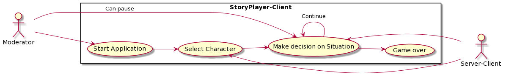

# Use-case diagrams

## Audience-Client

***

## Server-Client

***

##Story-Player-Client

The moderator is responsible for starting the application and can pause the voting of decisions.
A decision is always followed by a new decision until the end of the game.
***