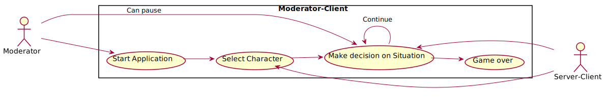

# Use-case diagrams

## Audience-Client

Via the Audience-Client, the individual spectator, as part of the audience, has the possibility to vote on the decisions that occur in the game. 
The Audience-Client is also an actor within the Server-Client.
***

## Server-Client

Server-Client receives the respective decisions from the Audience Client, collects and evaluates them in relation to the number of votes.
The server-client is also an actor within the StoryPlayer client.
***

## StoryPlayer-Client

The Server-Client tells the StoryPlayer-Client what decisions the audience has made. 
The moderator is responsible for starting the application and can pause the voting of decisions.
A decision is always followed by a new decision until the end of the game.
***
