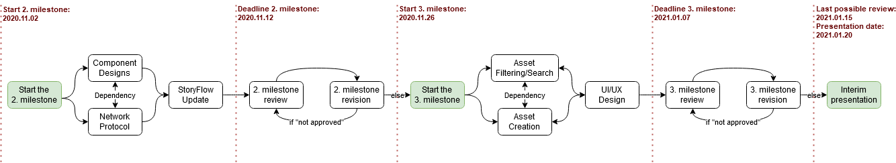

# Sprint-Review protocol from 2020.10.30

The review was held at 13:00 o'clock via Microsoft Teams. Customer and Scrum-Master attended the review.

## Table of Contents

- [Sprint-Review protocol from 2020.10.30](#sprint-review-protocol-from-20201030)
  - [Table of Contents](#table-of-contents)
  - [Contents of the Meeting](#contents-of-the-meeting)
    - [First Technical Specifications revision feedback](#first-technical-specifications-revision-feedback)
      - [Textual changes](#textual-changes)
      - [Use-case diagrams](#use-case-diagrams)
    - [Network protocol](#network-protocol)
    - [Server architecture](#server-architecture)
    - [Second and third milestone](#second-and-third-milestone)

## Contents of the Meeting

### First Technical Specifications revision feedback

The first revision of the Technical Specifications have been reviewed with the customer, which pointed out a last few textual errors and problems with the use-case diagrams. Besides those last few problems, everything else was faultless.  

!!! important 
    Overall the first milestone was approved without the need of further revisions, as long as the issues listed below are solved as discussed. Thus work on the second milestone can now officially commence. 

#### Textual changes

The following textual changes are to be made across the mentioned documents:

| Document location | What is to do |
| :--- | :--- |
| **Glossary: _DiceRandomness_** | Change "die" to "dice". |
| **Functional Requirements: _Offline-Mode_** | Change "the Moderator must be given the option to continue the game offline." to "the Moderator shall continue the game offline." |
| **Used Plugins: _Markdown All in One_** | Change "Virtual Studio Code" to "Visual Studio Code". |
| **Used Plugins: _PlantUML_** | Change "Virtual Studio Code" to "Visual Studio Code". |

In addition to the changes mentioned above, a new entry in the glossary for "Session" will be created. This should specify that a round of QualityQuest will be played where AudienceClients and ModeratorClient are connected to the server. 

#### Use-case diagrams

The diagrams and descriptions should be fixed to be exactly as described below:

**Start Application:**

* **Diagram:** Moderator (as Actor) -> Start Application (with Moderator-Client as system boundary) -> Server (as Actor)
* **Description:** The old diagram shall be converted into textual form and thus serve as the new description for the diagram.

**Play Game:**

* **Diagram:** "Can Pause" shall be changed to "Pause Game".
* **Description:** The description should specify that when the game is paused, a message is sent to the server, which will then ensure that voting is paused if it is currently takes place.

**End Application:**

* **Diagram:** Moderator (as Actor) -> End Application (with Moderator-Client as system boundary) -> Server (as Actor) -> End Session (with PlayerAudience-Client as system boundary) -> PlayerAudience (as Actor)
* **Description:** The description should describe the process of ending the game on the moderator's side, going through the server, ending up at PlayerAudience, and what exactly happens.

### Network protocol

The customer was shown a first draft of the network protocol, which was initially agreed and approved as reasonable. The drafting of the protocol can be continued accordingly.

### Server architecture

The customer was shown the structure of the physical server and how the individual logical components of the server will communicate with each other. Furthermore, the communication between server and clients was discussed in relation to the network protocol. So far everything was approved by the customer, insofar as the PlayerAudience clients implement a legally required cookie warning.

### Second and third milestone

Together with the customer, a rough time schedule for the next few months was discussed, including the interim presentation, which is shown below (informally) in graphic form (Alternatively the graphic can also be found in the "Miscellaneous" folder of the Docs.):

