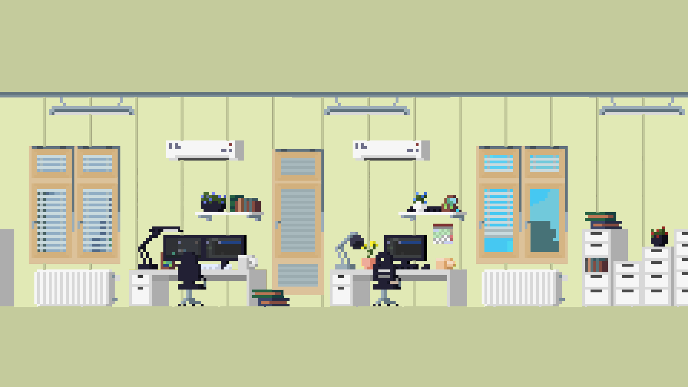
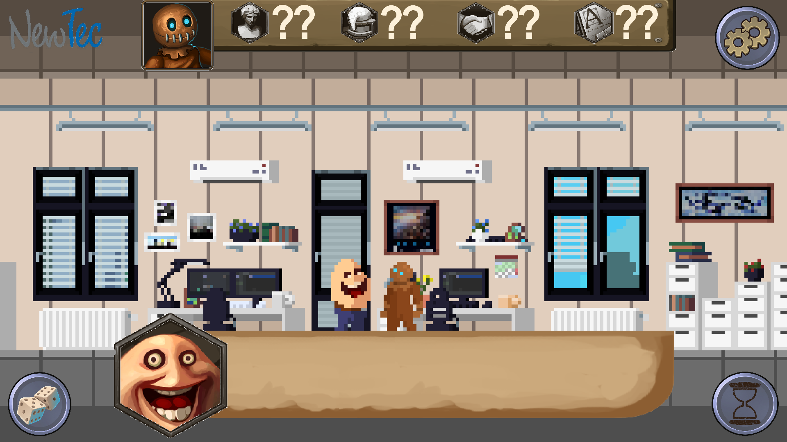

# Sprint-Review protocol from 2020.10.02

The review was held at 13:00 o'clock via Microsoft Teams. Customer and Scrum-Master attended the review.

## Table of Contents

- [Sprint-Review protocol from 2020.10.02](#sprint-review-protocol-from-20201002)
  - [Table of Contents](#table-of-contents)
  - [Contents of the Meeting](#contents-of-the-meeting)
    - [Approval of Technical Specifications](#approval-of-technical-specifications)
    - [Copyright Issues](#copyright-issues)
    - [Monster SFX](#monster-sfx)
    - [Technical specifications changelog](#technical-specifications-changelog)
    - [UI mockup](#ui-mockup)
        - [Approved palette mockup:](#approved-palette-mockup)
        - [Approved UI mockup:](#approved-ui-mockup)
    - [Assets/Music](#assetsmusic)
        - [Standard background music](#standard-background-music)
        - [Menu background music](#menu-background-music)
        - [Party background music](#party-background-music)
        - [Intro theme](#intro-theme)
        - [Hawaii workshop background music](#hawaii-workshop-background-music)
        - [Voting background music](#voting-background-music)
    - [Architecture diagram](#architecture-diagram)
    - [Storyflow diagram](#storyflow-diagram)
    - [Story/Dialogue-extension](#storydialogue-extension)
    - [UsedTools](#usedtools)
    - [Glossary/Requirements update](#glossaryrequirements-update)
    - [Idea document](#idea-document)
    - [Feedback from the customer](#feedback-from-the-customer)
    - [Tasks for the next weeks](#tasks-for-the-next-weeks)

## Contents of the Meeting

### Approval of Technical Specifications

The completion of the architecture design is nearing completion and only a few things still need to be done and fixed. Therefore I would like to ask everyone to implement these improvements by 2020.10.09, so that the customer has enough time to review them before the next review.

!!! important
    I would therefore personally ask everyone to look at the documents and diagrams that have been produced so far and to check them for possible errors so that the acceptance can take place as smoothly as possible. In doing so, one should look at what one has NOT done oneself in order to have another review procedure.

### Copyright Issues

The customer was advised that many of the assets provided were for direct use only and can not be legally distributed via github. Understanding the underlaying issue, the customer then provided the following options to choose from:

- The team continues to work with the provided assets and removes them from the Github Repo for the open source release to avoid legality issues.
- The team continues to work with the provided assets and creates placeholder graphics (e.g.: coloured rectangles) to replace the problematic assets for the open source release to avoid legality problems.
- The team searches for new assets from the Internet, which are completely royalty free and can be published on the repo without any problems.
- The team creates completely new assets for everything that is needed to avoid problems that can arise from using third-party assets.

!!! important
    The team is asked to make a decision on the above mentioned issues by the next review (2020.10.16).

### Monster SFX

The customer bought the team an SFX pack which can be easily integrated into Github and contains several hundred SFX of monster sounds. These can then be used for "dialogue sounds" or off-camera sounds.

!!! note
    These assets also fall under the [issue described above.](#copyright-issues)

### Technical specifications changelog

The customer said that he does not care about what happened before the first approval of the Technical Specification, so there is no need for versioning before that date.

The changelog should list any changes to the Technical Specifications between a specific period of time, so that in future the customer only needs to look at the changelog to find out what has changed.

### UI mockup

Various designs for the game were demonstrated to the customer, who in consultation with the marketing department decided to use the mockups listed below as guidelines for the palette and UI layout.

##### Approved palette mockup:

##### Approved UI mockup:

### Assets/Music

Due to the above mentioned [problems with possible copyright issues](#copyright-issues), the customer was played music by Royalty Free artist Kevin MacLeod, all of which were approved by the customer for the purposes listed below, but can also be used for other purposes, if it is seen as appropiate by the team.

!!! note
    The music listed below is only available for listening through MkDocs. For any other purposes the ../music/ folder has to be consulted.

##### Standard background music

Kevin MacLeod - Wallpaper
   
  <audio controls>
    <source src="/music/standard1.mp3" type="audio/mpeg">
  </audio>

Kevin MacLeod - Shades of Spring
   
  <audio controls>
    <source src="/music/standard2.mp3" type="audio/mpeg">
  </audio>

##### Menu background music

Kevin MacLeod - Airport Lounge
   
  <audio controls>
    <source src="/music/menu1.mp3" type="audio/mpeg">
  </audio>

Kevin MacLeod - Easy Lemon
   
  <audio controls>
    <source src="/music/menu2.mp3" type="audio/mpeg">
  </audio>

##### Party background music

Kevin MacLeod - Blue Ska
   
  <audio controls>
    <source src="/music/party1.mp3" type="audio/mpeg">
  </audio>

Kevin MacLeod - Upbeat Forever
   
  <audio controls>
    <source src="/music/party2.mp3" type="audio/mpeg">
  </audio>

##### Intro theme

Kevin MacLeod - Take a Chance
   
  <audio controls>
    <source src="/music/intro.mp3" type="audio/mpeg">
  </audio>

##### Hawaii workshop background music

Kevin MacLeod - Beach Party
   
  <audio controls>
    <source src="/music/hawaii.mp3" type="audio/mpeg">
  </audio>

##### Voting background music

Kevin MacLeod - Fluffing a Duck
   
  <audio controls>
    <source src="/music/wartemusik.mp3" type="audio/mpeg">
  </audio>

### Architecture diagram

The customer liked the diagrams so far, but noticed two things that still have to be done before the [technical specification can be approved:](#approval-of-technical-specifications)

- The class diagram does not show a fallback class/component that simulates the server or rather switches to offline mode if the game must continue in offline mode. Please add this to the class diagram. (The customer named the ["Facade pattern"](https://en.wikipedia.org/wiki/Facade_pattern) as a possible solution.)
- The component diagram for the server is still missing and should be added.

### Storyflow diagram

The storyflow diagram can be approved as is, as long as one changes "Christmas Party" to something more inclusive. Here too, we are welcome to come up with a Christmas alternative that would fit into the fantasy universe or simply use something like "company party".

!!! note
    It is not yet relevant for the next step, but for the detailed design in the next step, diagrams for each transition between two "states" in the StoryFlow diagram are to be defined. All possible dialogue options and relevant characters should then be incorporated into those diagrams.

### Story/Dialogue-extension

[See the note above](#storyflow-diagram) for information on story/dialogue extensions.

### UsedTools

The customer likes the idea of the UsedTools document and should, as suggested to and approved by him, contain the respective tools/plugins/libraries, which versions were used in each case and a description of what the respective "tool" was used for.

!!! example
    |  Tool  |                       Description                        | Version |
    | :----: | :------------------------------------------------------: | :-----: |
    | MkDocs | Documentation tool for creating stylised markdown files. |  1.1.2  |

### Glossary/Requirements update

Glossary and requirements must be checked for changes/errors in order to be up to date for [the approval by the customer.](#approval-of-technical-specifications)

!!! example
    An example of a requirement that is no longer relevant would be "gender", since the player will no longer have a gender, as [discussed in the last sprint review.](/docs/sprint-reviews/review_2020_09_18.md#story-extension)

### Idea document

In discussion with the client, the idea came up to create a document in which the team could collect random ideas that might or might not be relevant for the game at some point. But these should be only ideas and not elaborated concepts, since these could waste a lot of time.

### Feedback from the customer

The customer wants us to know that he is very satisfied with the work so far and that we should carry on the exact same way we have done so far.

### Tasks for the next weeks

- **Important for the next week (2020.10.02 - 2020.10.09):**
    - Update Requirements/Glossary.
    - Resolve Copyright issue.
    - Finish up architecture design.
    - Fix StoryFlow diagram.
    - Update UsedTools.
    - Create "idea document".
    - Create PDF-version of the Technical Specifications.
- **Important for the week after (2020.10.10 - 2020.10.15):**
    - Start working on the detailed/component design.

