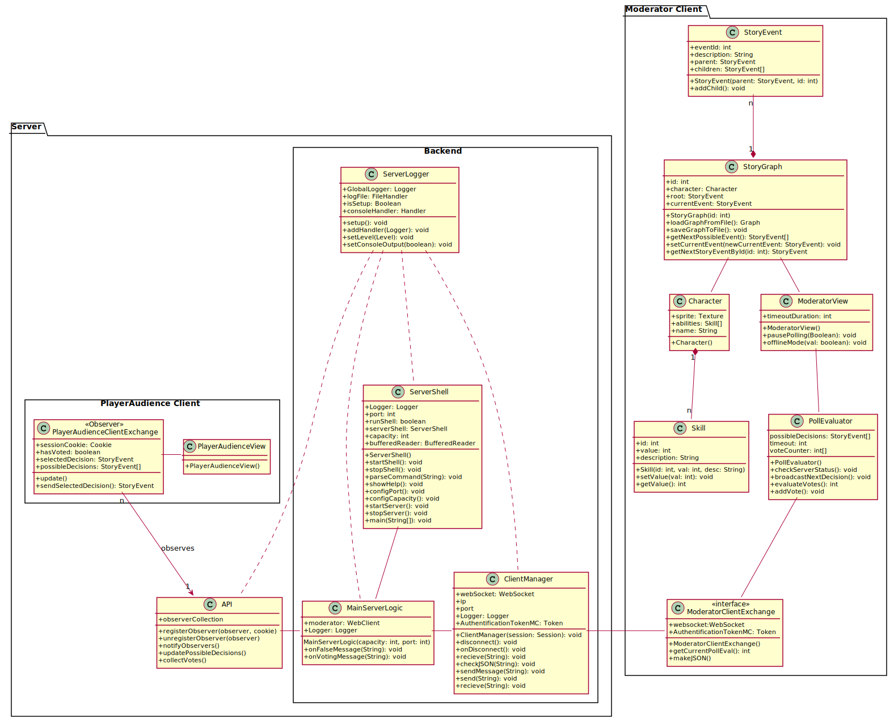
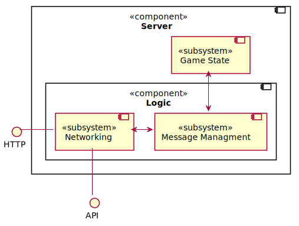
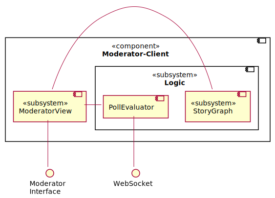

# Architecture diagrams

The diagrams below show the architectural structure of the different components of QualityQuest and how they communicate via well-defined interfaces.

## Class diagram

The class diagram shows the architectural structure of the individual components of QualityQuest and thus which classes are used in the implementation to logically implement the project. It also shows which interfaces the individual components use to communicate with each other.

Since the StoryGraph is run and build locally on the Moderator-Client and the server only has a forwarding and poll evaluation function (possible decisions get forwarded to the audience, polls get evaluated, result of the vote gets forwarded to the Moderator-Client), a fallback is easily possible with only the Moderator as decisionmaker.
So if the server is no longer accessible for the Moderator-Client, this will be noticed by the regular status requests and the Moderator will be informed together with the option to switch to Offline-Mode. Since the server only informs the Moderator-Client about the results of the voting, in case of a server failure, only the information about the voting conditions is lost for the Moderator-Client, because the actual decisions are made locally. 

In Offline-Mode, the timer is deactivated and the Moderator can select decisions directly, while status checks are still performed in the background to inform the Moderator in case the server becomes available again.

## Component diagrams

The class diagrams show the architectural structure of the individual components using interfaces/ports and subsystems.

### Component-Overview

An overview of all components of QualityQuest and which interfaces exist between the individual components, or the user interfaces of the participants.

### PlayerAudience-Client

Architectural overview of which subsystems and interfaces the PlayerAudience-Client component consists of.

### Server

Architectural overview of which subsystems and interfaces the Server component consists of.

### Moderator-Client

Architectural overview of which subsystems and interfaces the Moderator-Client component consists of.

