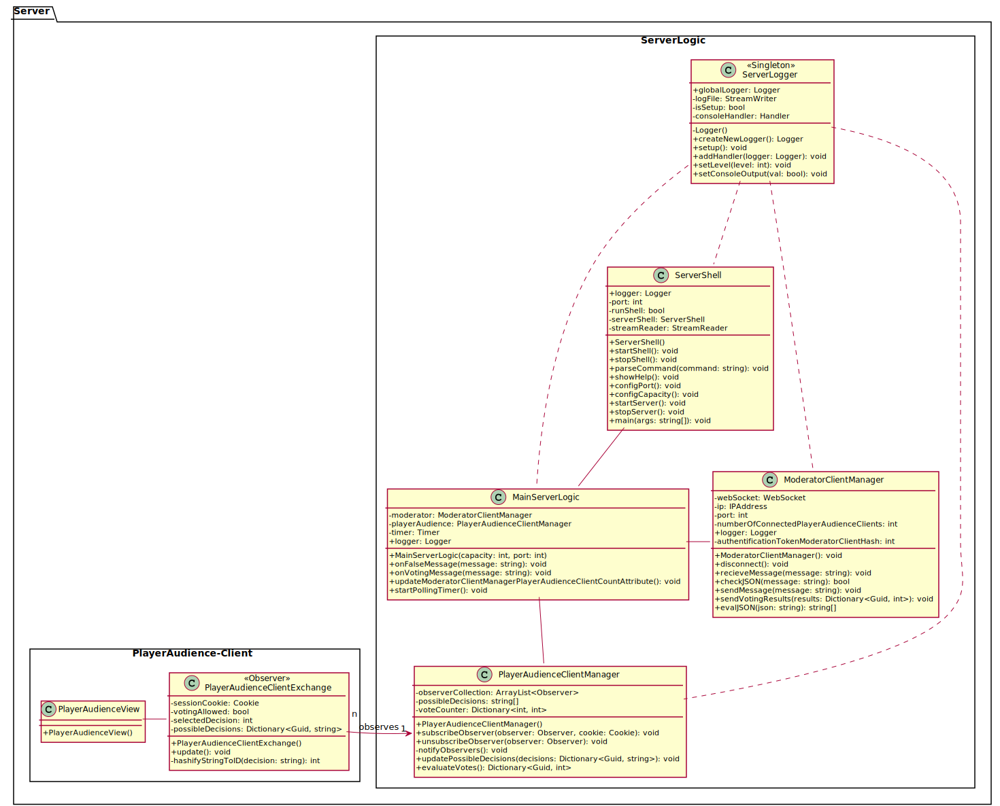

# Architecture diagrams

The diagrams below show the architectural structure of the different components of QualityQuest and how they communicate via well-defined interfaces. Since the architecture is currently still in the concept phase, future changes are very likely.

## Class diagrams

The class diagram shows the architectural structure of the individual components of QualityQuest and thus which classes are used in the implementation to logically implement the project. It also shows which interfaces the individual components use to communicate with each other.

Since the StoryGraph is run and build locally on the Moderator-Client and the server only has a forwarding and poll evaluation function (possible decisions get forwarded to the audience, polls get evaluated, result of the vote gets forwarded to the Moderator-Client), a fallback is easily possible with only the Moderator as decisionmaker.
So if the server is no longer accessible for the Moderator-Client, this will be noticed by the regular status requests and the Moderator will be informed together with the option to switch to Offline-Mode. Since the server only informs the Moderator-Client about the results of the voting, in case of a server failure, only the information about the voting conditions is lost for the Moderator-Client, because the actual decisions are made locally. 

In Offline-Mode, the timer is deactivated and the Moderator can select decisions directly, while status checks are still performed in the background to inform the Moderator in case the server becomes available again.

### Server class diagrams
The software components ***Audience Client*** and ***Server*** are located on the same physical device, which is also called **Server**. Therefore, the software component ***Server*** is referred to as ***Backend*** in this diagram. Accordingly, the AudienceClient corresponds to the front end. Since a separate ***AudienceClient*** with cookie is created for each call of the server URL in the form of a session, the communication between ***Backend*** and ***AudienceClient*** is realized via an interface *API*, which uses the Observer pattern. 
The communication between ***Backend*** and ***Moderator-Client*** is realized via a web socket connection, which is established after successful authentication.

## Component diagrams

The class diagrams show the architectural structure of the individual components using interfaces/ports and subsystems. Since the architecture is currently still in the concept phase, future changes are very likely.

### Component-Overview

An overview of all components of QualityQuest and which interfaces exist between the individual components, or the user interfaces of the participants. The physical device *Server* contains the actual ***Server*** component as backend, while the ***PlayerAudience-Client*** component corresponds to the frontend. Since there are several instances of the ***PlayerAudience-Client***, the communication between front- and backend is done via an *API*, which uses the observer-pattern. The exchange between ***Server*** and ***Moderator-Client*** is realized via a *Websocket* connection.

### PlayerAudience-Client

The ***PlayerAudience-Client*** component consists of a subsystem *GUI*, which will allow the user to interact via the *user interface* using HTML and Javascript, and the subsystem *Logic*, which is responsible for the interpretation of input and the exchange via the *API*.

### Server

The ***Server*** component consists of a subsystem for the *Poll Evaluation*, which interprets the determined results, and a *Logic* component. These in turn contain a subsystem *Networking*, which is responsible for the entire handling of communication via the interfaces *Websocket* and *API*. Connected to this is the subsystem *Message Management*, which prepares the received data for the *Poll Evaluation* and puts the results into a suitable format for sending.

### Moderator-Client

The component ***Moderator-Client*** consists of a subsystem *GUI*, which, based on Unity, provides a *moderator interface* for interaction and presentation of the game. The subsystem *Logic* manages the progress in the game tree, the influence of stats on decisions as well as the communication to the component ***Server*** via the *Websocket*.

