# StoryFlow diagram

A rough overview of the decisions occurring within the story. The diagram exclusively depicts the situations in which decisions can be made and the choices to be made in these situations.

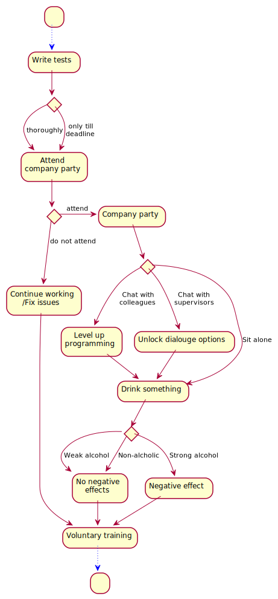

## Detailed-StoryFlow diagrams

A detailed overview of the individual decisions. The diagrams contain all individual situations with every possible decision and all effects of the individual decisions.

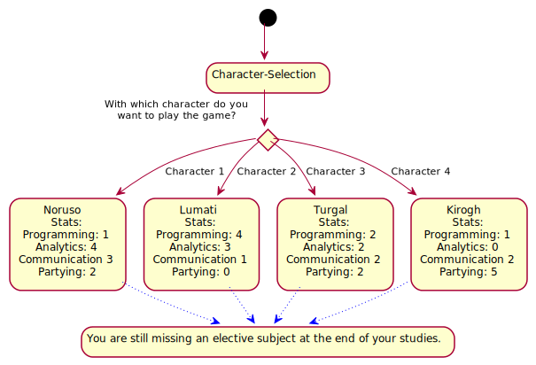

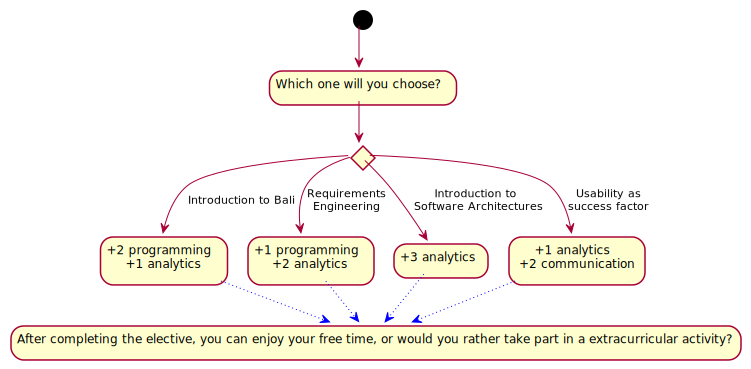

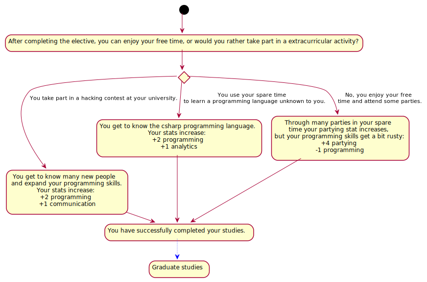

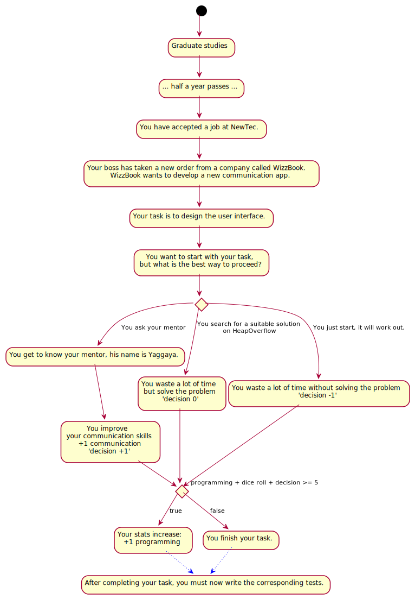

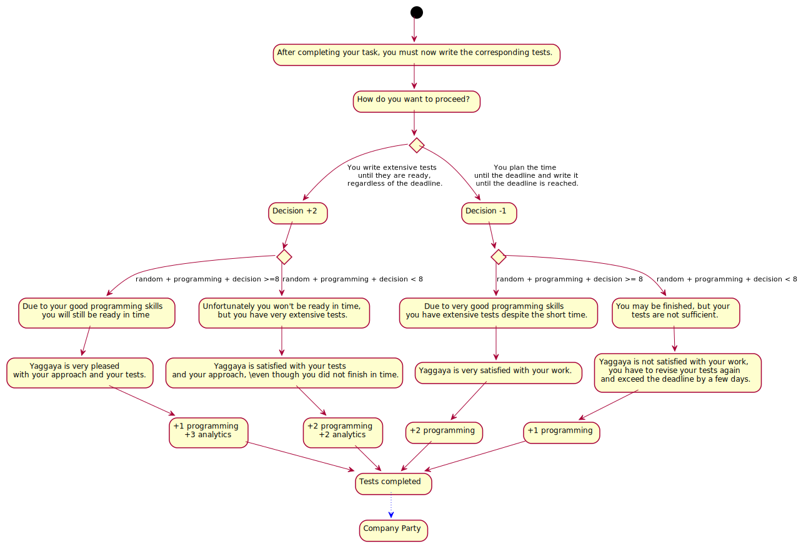

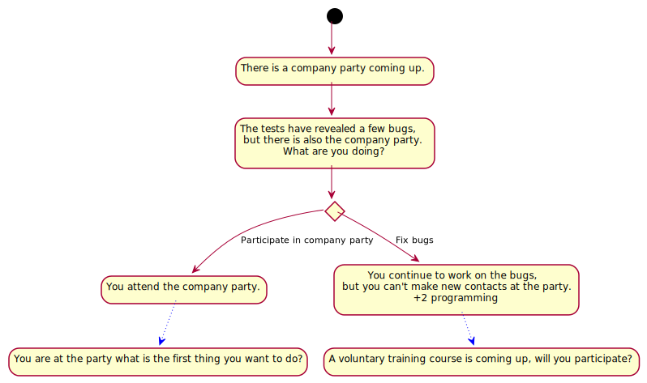

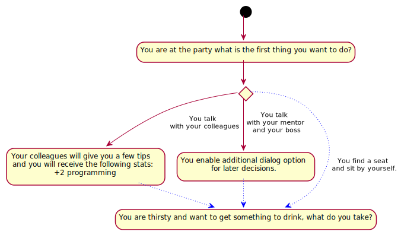

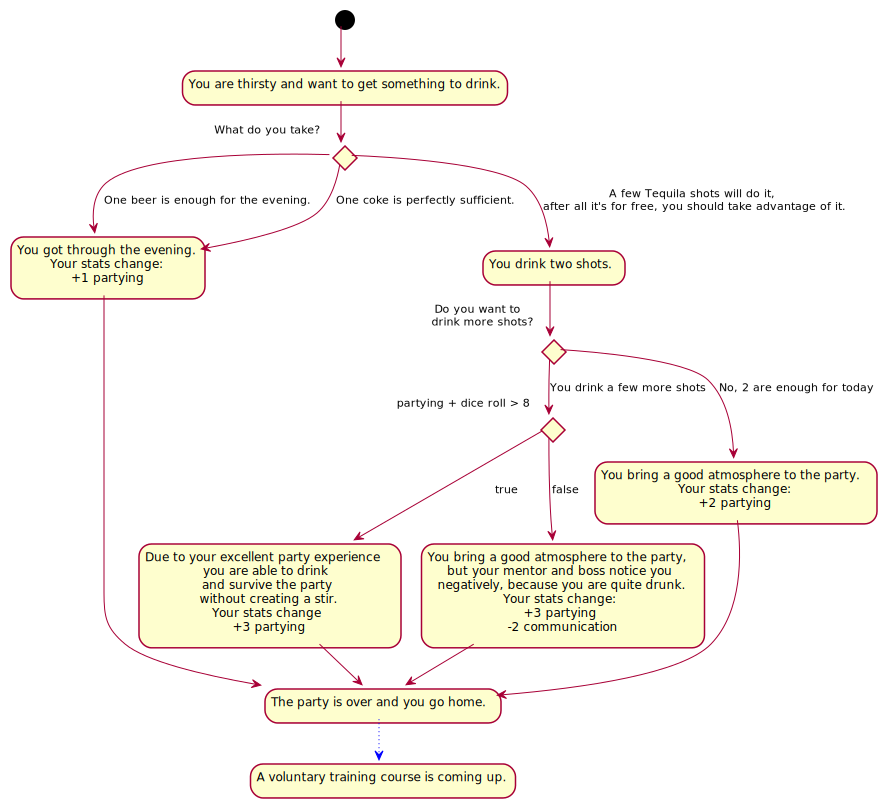

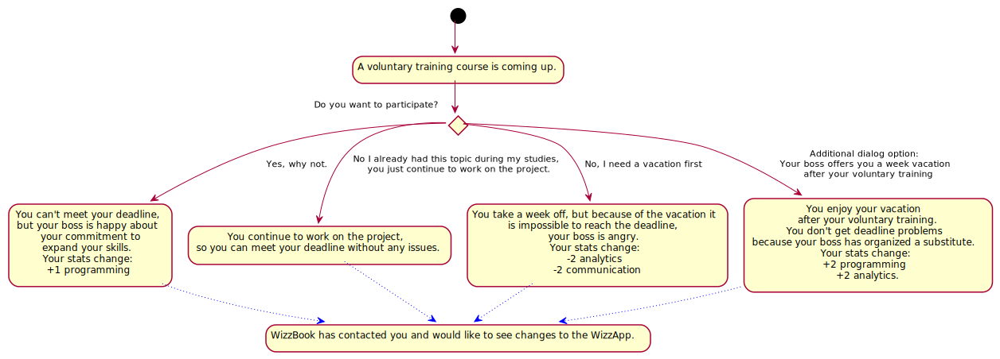

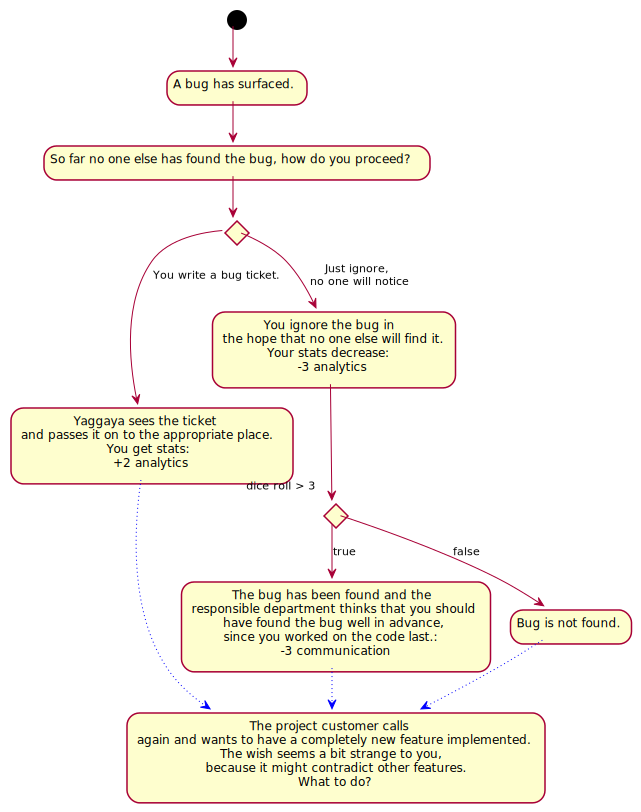

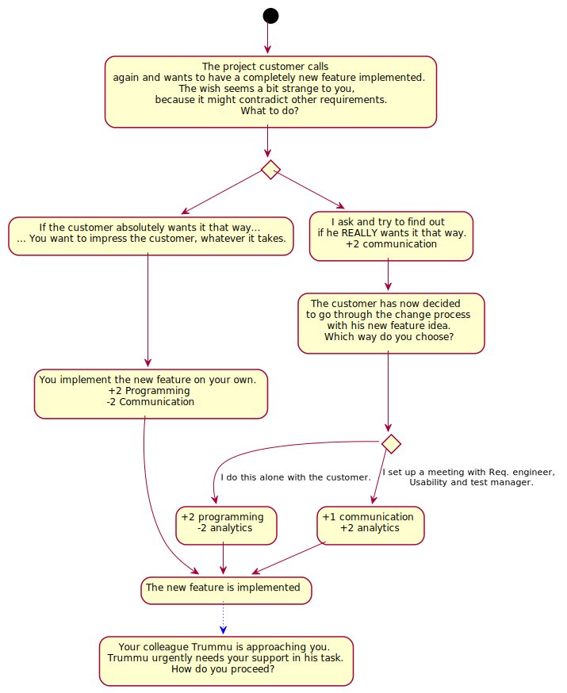

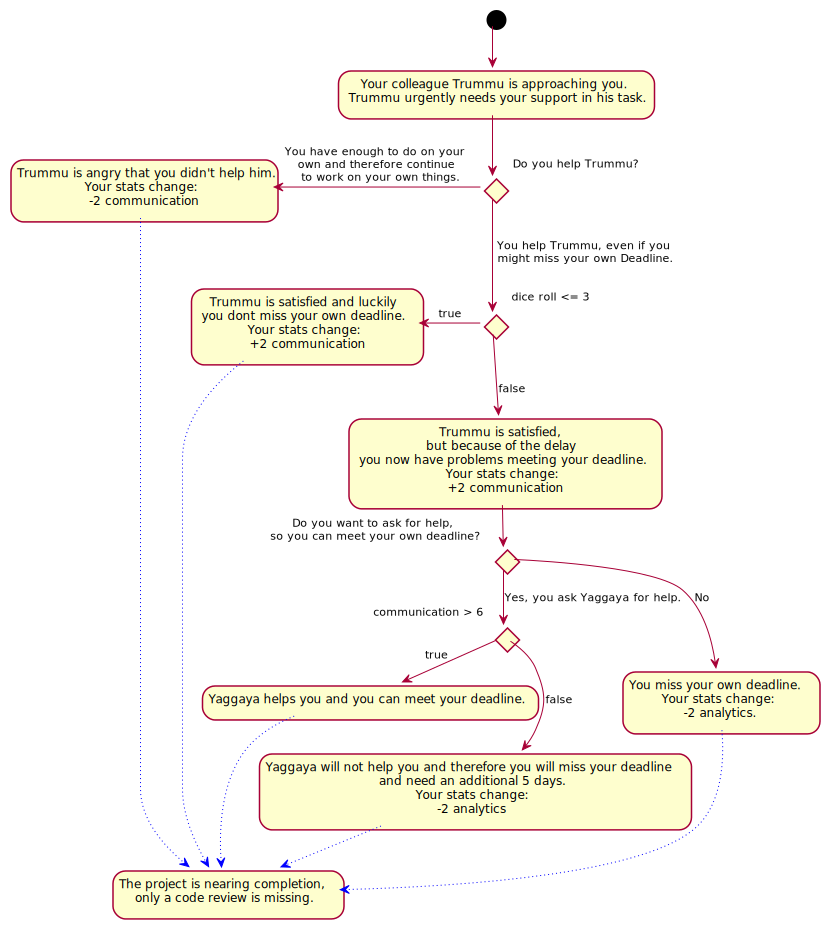

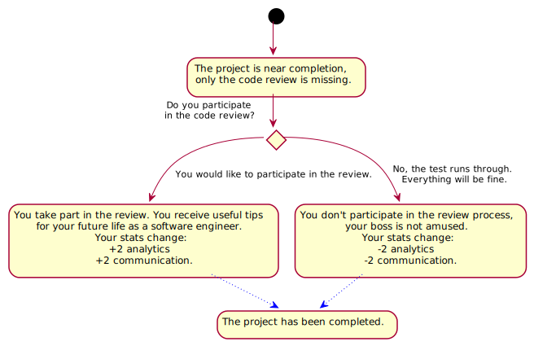

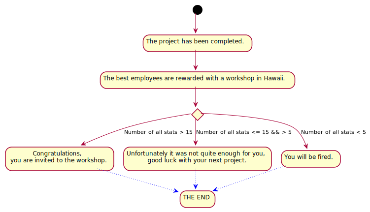

