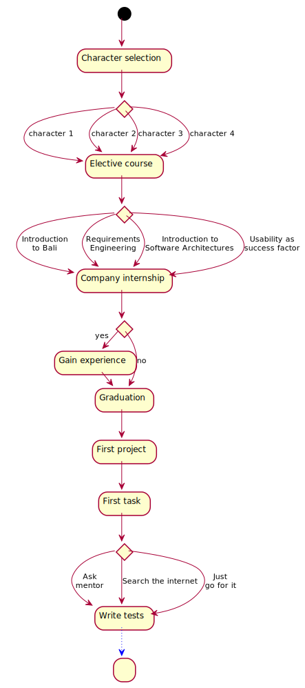
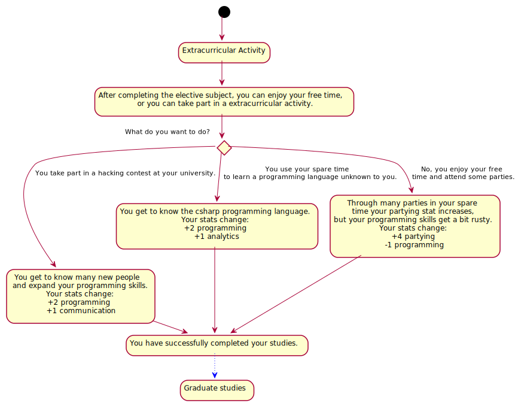
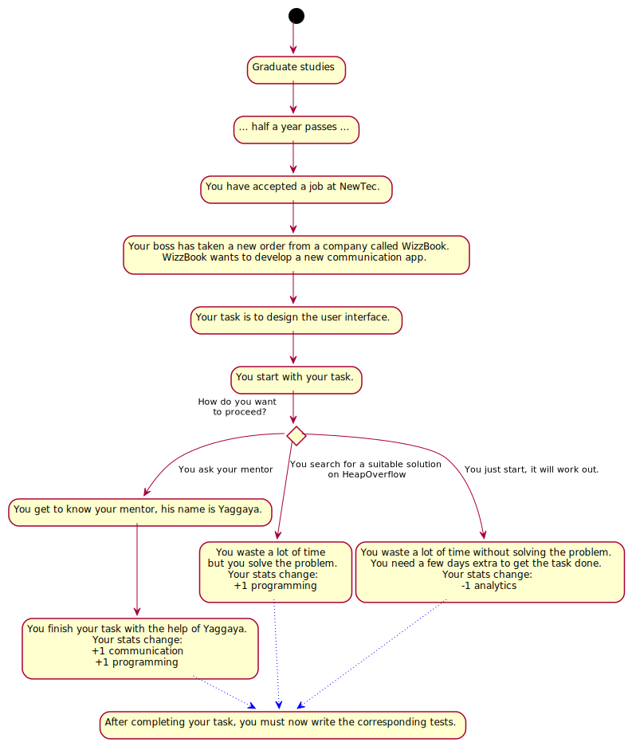
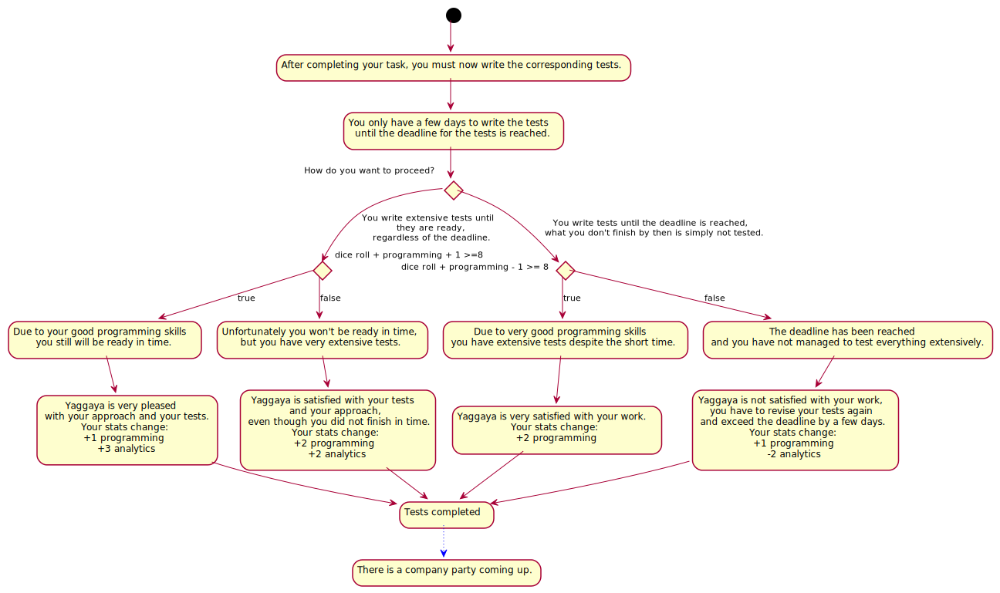
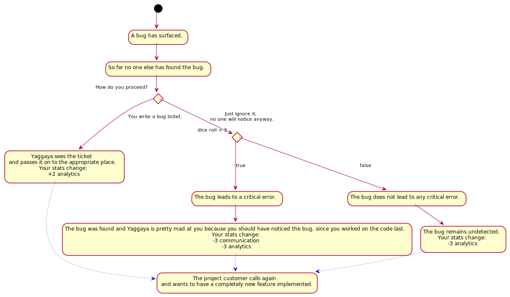
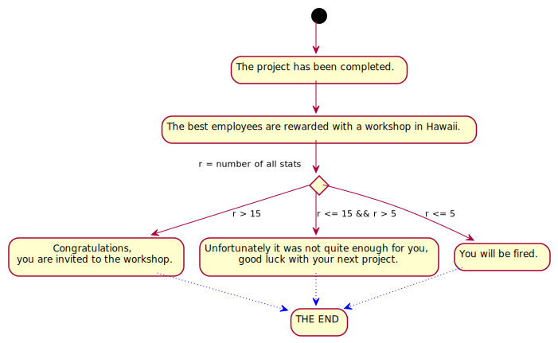

# StoryFlow diagram

## StoryFlow overview

A rough overview of the decisions occurring within the StoryGraph. The diagram exclusively depicts the situations in which StoryFlowDecisions can be made and the choices to be made in these situations.

## Detailed StoryFlow diagrams

A detailed overview of the individual StoryFlowDecisions. The diagrams contain all individual situations with every possible StoryFlowDecision and all effects that result by choosing the respective StoryFlowDecision.

### StoryFlowDecision 1

In this StoryFlowDecision the PlayerAudience decides with which PlayerCharacter they want to play the game. The following PlayerCharacters are available for selection:
``

* Noruso
* Lumati
* Turgal
* Kirogh

After the PlayerCharacter selection, the next step is selecting the missing subject.

### StoryFlowDecision 2

The PlayerAudience must choose a subject from the following selection of available subjects:

* Introduction to Bali
* Requirements Engineering
* Introduction to Software Architectures
* Usability as success factor

After finishing the subject, the PlayerCharacter gets additional stats, depending on which subject was voted for.

### StoryFlowDecision 3

Now that the PlayerCharacter has finished their subject, the PlayerAudience can decide if the PlayerCharacter should take part in an extracurricular activity, or not. The following options are available:

* The PlayerCharacter can participate in a hackathon at the university
* The PlayerCharacter can use the time to learn a new programming language
* The PlayerCharacter does not participate in any extracurricular activity and enjoys his free time and goes partying

The PlayerCharacter has successfully completed his studies.

### StoryFlowDecision 4

The PlayerCharacter has successfully completed their studies and accepted a job at NewTec GmbH some time after. Which means that the PlayerCharacter now has to complete their first task in a new project. The PlayerAudience decides how the PlayerCharacter will proceed:

* The PlayerCharacter asks the mentor for advice
* The PlayerCharacter looks for a suitable solution on HeapOverflow
* The PlayerCharacter simply starts working

The stats of the PlayerCharacter change according to the selected decision and after the task has been completed, the next decision is about the corresponding tests.

### StoryFlowDecision 5

The first task has been completed, the next StoryFlowDecisions is about the corresponding tests. The PlayerCharacter has only a certain amount of time until the tests have to be finished, and the PlayerAudience has to decide how the PlayerCharacter should proceed. The following options are available: 

* The PlayerCharacter writes the tests until they are ready, regardless of the deadline 
* The PlayerCharacter writes the tests until the deadline is reached

The outcome of the decision is also influenced by a DiceRandomness. Depending on the decision and some luck the PlayerCharacter gets stats added and/or subtracted. After the tests are done, a company party is scheduled and the decision for the PlayerCharacter to participate is part of the next StoryFlowDecision.
``

### StoryFlowDecision 6

The PlayerAudience can decide in the next StoryFlowDecision whether the PlayerCharacter will participate in the company party or not. The following options are available:

* The PlayerCharacter attends the company party
* The PlayerCharacter does not take part in the party, but continues working on the project

If the PlayerCharacter goes to the party, the PlayerAudience must decide in the next StoryFlowDecisions how the PlayerCharacter behaves on the party. If the PlayerCharacter does not attend the party, the next StoryFlowDecision is about possibly participating in a voluntary training course.

### StoryFlowDecision 7
The PlayerAudience can now decide what the PlayerCharacter does first on the party:

* The PlayerCharacter talks with colleagues
* The PlayerCharacter talks with the mentor and the boss
* The PlayerCharacter sits alone on one seat

Depending on the StoryFlowDecision, the PlayerCharacter increases their stats or the PlayerAudience enables additional dialog options for later StoryFlowDecisions. 

### StoryFlowDecision 8

The PlayerCharacter is still at the party and is thirsty. The PlayerAudience decides what the PlayerCharacter will drink:

* One beer
* One coke
* Two Tequila shots. This decisions triggers another StoryFlowDecision, the PlayerAudience needs to decide if the PlayerCharacters wants to drink more after the first two shots of Tequila:
  * The PlayerCharacters keeps drinking more shots
  * The PlayerCharacter stops after the first two shots

If the PlayerAudience decides to drink beer or coke, the evening ends quietly. If the PlayerAudience decides to drink hard liquor, the party may instead end badly, resulting in the PlayerCharacter losing PlayerCharacterStatusValues due to getting severely drunk and ruining the event. Eventually the party ends and the PlayerCharacter goes home. The next StoryFlowDecision is about the participation in a voluntary training course.

### StoryFlowDecision 9

The PlayerAudience can now decide if the PlayerCharacter takes part in a voluntary training course. The following options are available:

* Yes, the PlayerCharacter participates
* The PlayerCharacter does not participate
* The PlayerCharacter takes a vacation
* Additional dialog option: The boss of the PlayerCharacters offers one week of vacation after the voluntary training course

Depending on the StoryFlowDecision, there may be a deadline delay and an increase or decrease of the PlayerCharacterStatusValues. After the voluntary training course is over, the customer calls because they want to make changes to the product. The PlayerAudience decides how to proceed in the next StoryFlowDecision.

### StoryFlowDecision 10

The customer explains on the phone what he wants to change, now the PlayerAudience can decide how the PlayerCharacter proceeds: 

* The PlayerCharacter simply hangs up
* The PlayerCharacter implements the change directly
* The PlayerCharacter notices that the change is technically not easy to implement. This decision triggers another StoryFlowDecision: 
  * The PlayerCharacter informs the customer
  * The PlayerCharacter does not inform the customer

The stats of the PlayerCharacter change depending on the decision made by the PlayerAudience. Since a new bug occurs, the PlayerAudience has to decide how the PlayerCharacters will proceed in the next StoryFlowDecision.

### StoryFlowDecision 11

A new bug has surfaced that nobody has found yet. The PlayerAudience can choose from the following options: 

* The PlayerCharacter writes a bug ticket
* The PlayerCharacter ignores the bug

If the PlayerAudience decides to ignore the bug, the bug will be noticed with a certain DiceRandomness from others, and the stats decrease is more severe than if the bug remains undetected. Reporting the bug instead brings additional stats for the PlayerCharacter. In the next decision the customer calls again, because he wants to have an additional feature implemented.

### StoryFlowDecision 12

The customer explains the new feature on the phone, now the PlayerAudience must decide how the PlayerCharacter proceeds:

* The PlayerCharacter starts to implement the feature
* The PlayerCharacter asks the customer if he really wants the feature. This decision triggers another StoryFlowDecision. The customer wants to go through the change process with his new feature idea. The PlayerAudience can choose from the following options:
  * The PlayerCharacter implements the feature together with the customer
  * The PlayerCharacter sets a meeting with req. engineer, usability and test manager

The feature is implemented and depending on the decision, the stats of the PlayerCharacter change. In the next decision the PlayerAudience has to decide if the PlayerCharacter helps out a colleague or not.

### StoryFlowDecision 13

A colleague approaches the PlayerCharacter and asks for help with a task. The PlayerAudience can choose from the following options:

* The PlayerCharacter helps the colleague. This decision triggers another StoryFlowDecision, since the PlayerCharacter cant meet his own deadline:
  * The PlayerCharacter asks another colleague for help on his own task.
  * The PlayerCharacter works alone on his task.
* The PlayerCharacter keeps working in his own task.

Depending on the decision, the PlayerCharacterStatusValues change, while DiceRandomness may also cause additional deadline delays. The project is nearing completion, the next StoryFlowDecision will be about how to handle a code review.

### StoryFlowDecision 14

The PlayerAudience must decide whether the PlayerCharacter takes part in a code review. The following options are available: 

* The PlayerCharacter participates in the review
* The PlayerCharacter does not participate in the review

If the PlayerCharacter participates in the review, the PlayerCharacterStatusValues increase, otherwise they decrease. The project has been completed.

### StoryFlowDecision 15
A workshop in Hawaii is on the agenda. All PlayerCharacterStatusValues will be summed up and depending on the sum there are following options:

* The PlayerCharacter can participate in the workshop
* The PlayerCharacter is not allowed to participate in the workshop
* The PlayerCharacter gets fired.
  
The game was successfully played through.

