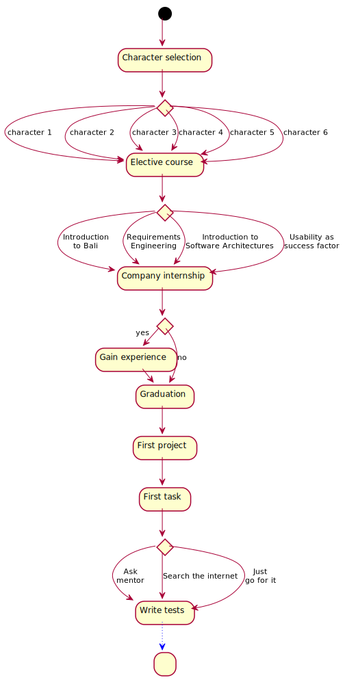

# StoryFlow diagram

A rough overview of the decisions occurring within the story. The diagram exclusively depicts the situations in which decisions can be made and the choices to be made in these situations.

| | | |
|:--:|:--:|:--:|
||||

