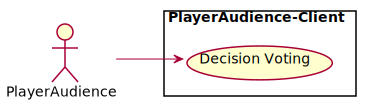
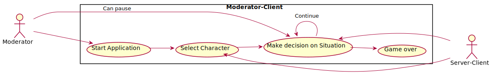

# Use-case diagrams

## PlayerAudience-Client

Via the PlayerAudience-Client, the individual participant, as part of the audience, has the possibility to vote on the decisions that occur in the game. 
The PlayerAudience-Client also acts as an actor for the server.
***

## Server

Server receives the respective decisions from the PlayerAudience-Client, collects and evaluates them in relation to the number of votes.
The server also acts as an actor for the Moderator-Client.
***

## Moderator-Client

The Server tells the Moderator-Client what decisions the audience has made. 
The Moderator is responsible for starting the game and can start and pause the voting process at any given time.
A decision is always followed by a new decision until the game eventually ends.
***
