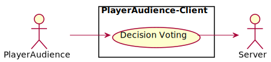
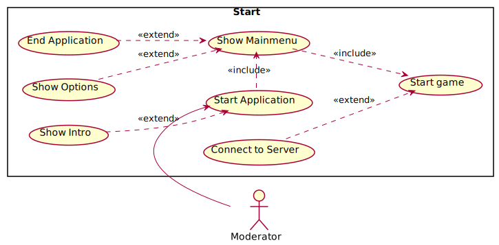
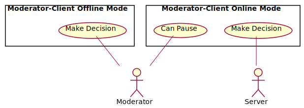
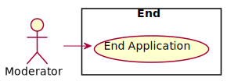

# Use-case diagrams

## PlayerAudience-Client

Via the PlayerAudience-Client, the individual participant, as part of the audience, has the possibility to vote on the decisions that occur in the game. 
The PlayerAudience-Client also acts as an actor for the server.
***

## Server

Server receives the respective decisions from the PlayerAudience-Client, collects and evaluates them in relation to the number of votes.
The server also acts as an actor for the Moderator-Client.
***

## Moderator-Client

### Start Application

The moderator is responsible for starting the application. From the main menu the moderator can change settings or close the application directly. The moderator can establish a connection to the server to play the game with online polling or the moderator can start the game in Offline-Mode.
***

### Play Game

If there is a connection to the server, the server is gathering data from the audience and telling the Moderator-Client what is to be done depending on the data collected and the moderator can pause the game. If there is no connection, the moderator plays the game.
***

### End Application

The moderator is responsible for ending the application. If the application is closed, the session with the server is also terminated.

