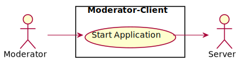
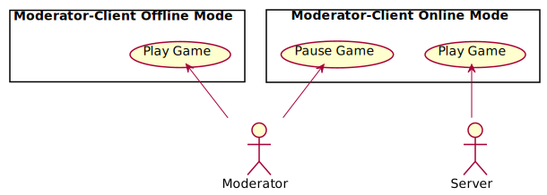

# Use-case diagrams

## PlayerAudience-Client

Via the PlayerAudience-Client, the individual participant, as part of the PlayerAudience, has the possibility to vote on the StoryFlowDecisions that occur in the game. 
The PlayerAudience-Client also acts as an actor for the ServerLogic.

## ServerLogic

The SevrerLogic receives the respective StoryFlowDecisions from the PlayerAudience-Client, collects them and evaluates them in relation to the number of votes.
The ServerLogic also acts as an actor for the Moderator-Client.

## Moderator-Client

### Start application

To start the game the Moderator-Client has to be launched by the moderator first. During the start of the application a flash screen with the NewTec logo is shown after which the main menu is loaded- In the main menu, a connection to the ServerLogic must first be established to start an Online-Session. If a connection has been established the game can be started through the menu. Alternatively there is the option to start the game in Offline-Mode in case no connection to the ServerLogic can be established or online voting is not needed. In the main menu an option sub-menu allows the moderator to set options like volume, resolution and language. The main menu also allows the moderator to close the game.

### Play game

If there is an Online-Session to the ServerLogic, the ServerLogic gathers data from the PlayerAudience and tells the Moderator-Client what has to be done depending on the data collected. The moderator can pause the game locally, which simultaneously sends a message to the ServerLogic to stop the voting process on the ServerLogic side. If there is no Online-Session, the moderator plays the game in form of a Offline-Session.

### End application

The moderator is responsible for ending the application. When the moderator ends the application, and an Online-Session is in progress, a message is sent to the ServerLogic to end the current Online-Session with the PlayerAudience-Clients.
